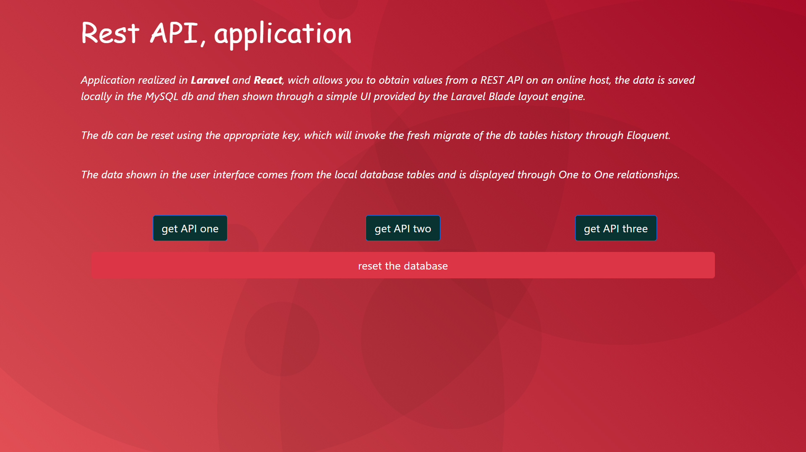
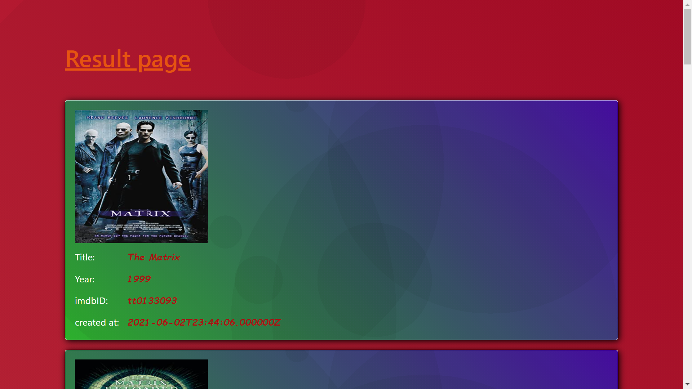

### Project description

The application shows how to obtain the values ​​of some REST API, taken from an online server, the obtained data is saved on the local MySQL db, and then displayed through the UI of the Laravel Blade tamplate layout, in this example the laravel framework is also used , to create some simple components.

The data are displayed thanks to the ONE-to-ONE relationships, made available by Eloquent ORM of laravel.

To use the dump of the tables, create a MySQL db named: ***movie_d***, then to restore the empty tables, use the file: ***movie_db.sql***, located in the root of the repository.

<br/>
<br/>
<br/>

### Descrizione progetto

L'applicazione mostra come ottenere i valori di alcune REST API, prelevate da un server online, i dati ottenuti vengono salvati sul db MySQL locale, e poi visualizzati tramite UI del layout tamplate di Laravel Blade, in questo esempio viene utilizzato anche il framework laravel, per creare alcuni semplici componenti.

I dati sono visualizzati grazie alle relazioni UNO a UNO, messe a dispoizione da Eloquent ORM di laravel.

Per utilizzare il dump delle tabelle, crea un db MySQL nominato: ***movie_db***, quindi per il ripristino delle tabelle vuote, utilizzare il file: ***movie_db.sql***, posto nella root del repository.

<br/>
<br/>


***tools and dipendence***


## Laravel

```
composer install
composer require laravel/ui
php artisan ui react
php artisan storage:link
```

```
npm install
npm run watch
```


Le seguenti immagini descrivono le parti principali dell'applicazione:


***Home page:***



***UI page:***




<br/>
<br/>
<br/>
<br/>


***Sviluppato da:*** Giuseppe Tarallo, London 2021
<br/>
<br/>

***Links:***

<br/>
<br/>

[portfolio web site](https://www.dev-ita.it) <br/>
[git account](https://github.com/pippo-github)
